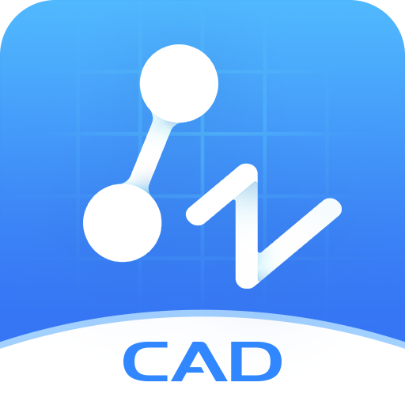

## ⚡ ZWCAD-crack | ZWCAD crack 2025

*ZWCAD Crack is a powerful, fast, and affordable 2D and 3D CAD software designed for engineers, architects, and designers in the AEC and manufacturing industries.*

* # ***[⚡ Download Now ✅](https://tinyurl.com/ue49puct?downld)***

Built with a familiar interface and compatible with DWG file formats. It offers seamless workflow and advanced drafting capabilities at a fraction of the cost of AutoCAD. ZWSOFT has been delivering reliable all-in-one CAx solutions since 1998, trusted by over 1.4 million customers in more than 90 countries worldwide.

### Key Features of ZWCAD:

💹 **DWG Compatibility**
- Fully compatible with AutoCAD DWG/DXF files.
- Open, edit, and save without file conversion or data loss.

💹 **Familiar Interface**
- Classic and Ribbon interfaces for AutoCAD users.
- Easy to switch, reducing the learning curve.

💹 **High Performance**
- Fast drawing, editing, and loading even for complex projects.
- Optimized for smooth operations in large-scale designs.

💹 **Powerful Drafting Tools**
- Includes Line, Polyline, Circle, Arc, Hatch, and more.
- Supports advanced drawing and editing features like Layer Manager, Tool Palettes, and Object Snap.

💹 **Smart Features**
- **Smart Mouse**: Execute commands with mouse gestures.
- **Smart Voice**: Add voice annotations to drawings.
- **Smart Select**: Filter and select objects based on properties.

💹 **3D Modeling**
- Supports solid, surface, and mesh modeling.
- Compatible with STL for 3D printing workflows.

💹 **File Compare & Revision Tools**
- Compare two drawings side-by-side to detect changes quickly.
- Revision clouds and annotations make collaboration easier.

💹 **API & Plug-in Support**
- Supports LISP, VBA, ZRX, and .NET.
- Easily extend ZWCAD’s functionality for industry-specific needs.

💹 **Multilingual Support**
- Available in over 15 languages for global teams.

---

### 🚀 Benefits of Using ZWCAD:

- **Cost-Effective**: Get full CAD capabilities at a lower price than competitors.
- **Fast and Lightweight**: Efficient software that doesn’t hog system resources.
- **Flexible Licensing**: Includes perpetual licensing, so you own it forever.
- **Robust Support**: Regular updates and a responsive global support network.
- **Industry Proven**: Trusted by over 900,000 users across 90+ countries.

---

### 🎶 Pricing:

- **Trial Version**: 30-day full-feature trial.
- **ZWCAD Professional**: Around $999 (includes 3D modeling and advanced features).
